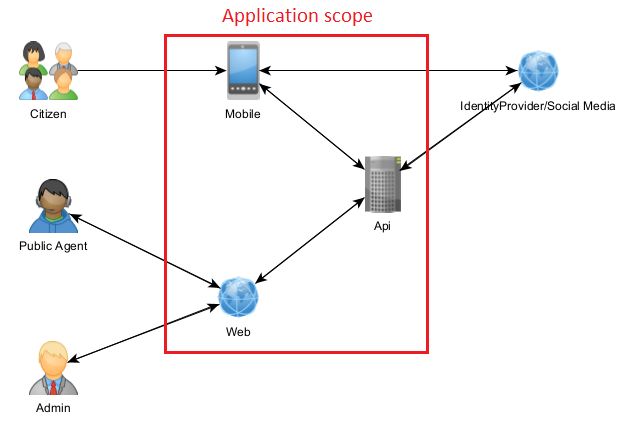

# Greetings

The current fullstack project is a prototype for an *urban janitory system*. I've already have done a project for 
this business case but code grew a little bit complex and i haven't the guts to touch it again. 
I still aiming to refactor it but i'd rather start a project from scratch.
In this approach i'm trying to provide all required features by writing the less code i can figure out.

## Project Structure:

### Topology

- Mobile project
- Web project
- Api project

## Use case description (unformal)

### Actors

- *Citizen*: People that live/work/study around the city and need to report to the city hall 
an irregularity that happened in the city or request a service for the public space. 
Probably the large majority of users have access to a smartphone device so there will need 
a mobile app to serve as interface for those actors. Citizens can be authenticated or annonymous 
and for this case a federeted identity strategy can fullfil the authetication process. 
Basically they will fill up a form that some fields contains pre-defined fields in order to 
avoid ambiquity, also they can provide images and its location can be geo localized.

- *Public Agent*: Individuals that are employees of the city hall who provide their service 
to meets the city popultaion needs. The city hall provides a enough amount of computer devices 
to be used as a work tool so the system can be accessible for them as a web application. 
It's interesting to manage this type of user internally and manage it's authentication locally.
Some public agents can have admin privileges. Public agents are tied to only one *department*. 
The core task for the agent is to create an *action* to solve a citizen *call*.

- *Admin*: Admins are a special type of public agent. The can be tied to one department or not.
Their tasks are to manage *departments*, other agent *accounts* (according with the tied department 
to admin, if tied), get some metrics like calls of a particular *address*(zip code, public place, 
district), manage the scope of services (*duties*) provided to the users.

### Class diagram

## Stack used:

- Android development platform

There are lots of work to be done